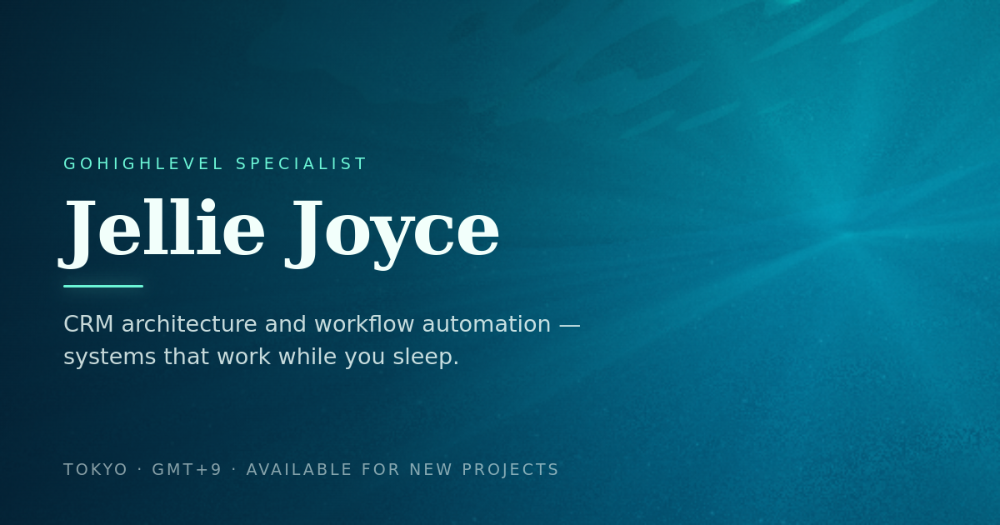

# Jellie Joyce — Ocean Portfolio

> Systems that keep things moving.

A single-page portfolio for a **GoHighLevel specialist / automation architect**, built
around one idea: **scrolling the page is a dive.** The page starts above the waterline
and descends 40 m to the seabed as the visitor reads — sky, sun glitter, Snell's window,
reef, and sand.



The background is not a video and not a sprite sheet. It is one WebGL fragment shader
that renders a physically-motivated water column in real time, driven by scroll depth.

---

## ✦ Highlights

**The renderer** (`assets/js/ocean.js`, no dependencies)

| Effect | How it works |
| --- | --- |
| Water colour | Jerlov coastal-water optics: separate beam attenuation per RGB channel, scattering albedo, and Lambertian surface shading. Red dies at ~8 m, blue survives — the palette is computed, not hand-picked. |
| Surface caustics | Baked once per frame into a tileable 256² texture, then reused by the seabed, the underside of the surface and the light shafts, so every highlight in the scene is coherent. |
| God rays | A real single-scattering volume integral: the view ray is marched through the water and at every sample the sunbeam is traced back up to the surface, where the caustic texture says how hard the swell is focusing light. Sunlight is **refracted on entry** — 18° of elevation in air becomes ~44° in water — which throws the point where every shaft converges off the top of the frame at every depth (1.04–3.05 screen heights). You see the shafts crossing the water; you never see the starburst they radiate from. A tight fade on the sun's own direction is the belt-and-braces. |
| Light dapple | A second, non-directional modulation — two uncorrelated low-frequency fields drifting through the water, verified independent (correlation 0.00). Stops the shafts from looking mechanical. Mean-preserving, so the exposure never shifts. |
| Snell's window | Exact Fresnel (s and p polarisation) with total internal reflection, so the underside of the surface is a bright 97° disc of sky ringed by a mirror of the deep. |
| Marine snow | Deliberately sparse. Gaussian-soft, sized by perspective, tinted by the water (never whiter than it), drifting on a slow current so they never hang still. **Camera-anchored, not world-anchored** — the grid is sampled against the camera's right/up axes rather than in world space, so the field is pinned on screen. With world sampling every mote slid up the frame as the camera descended, which reads as the background tracking the scroll; measured after the change, it travels 0 px vertically between 26, 30 and 34 m with the clock frozen. It belongs to the deep and arrives by fading up from 24 m rather than sliding into frame, so scrolling only decides how present it is. |
| Bubbles | From 10 m down, easing in over the next six metres. Same camera-anchored sampling, so they cannot slide with the scroll either — the only thing that moves one is its own rise (verified climbing, roughly 25 px per 3 s). Each column climbs at its own rate and wobbles on the way. Drawn as a bright rim around a hollow middle rather than a dot, because a dot reads as another mote of snow. Deliberately faint: 0.002% mean change to the frame at 20 m, individual specks peaking near 19% brightness. |
| Fish | Solitary reef species — deep bodies, blunt snouts, short caudal fans tucked in behind a narrow peduncle — drifting alone rather than in schools, 18 of them. Six markings are in the mix —
banded, lateral stripe, dark back over pale belly, tail ocellus, speckled, plain — plus a contrasting
caudal fin on about half of them, so no two read alike. Only one of the six is striped. Two details are easy to get wrong: the profile is floored at a fifth of the body depth so neither end tapers to a needle, and the silhouette is **explicitly bounded in x** — the body-length parameter is clamped, so without that bound the profile keeps drawing at its floor height past the snout and past the peduncle, which reads as a pole stuck through the mouth and a stick out of the tail. Tints are picked for the hue that survives the water: a warm clownfish at 20 m simply reads blue, so the albedos are chosen to land on green, teal, cyan, blue and violet *after* the filter (measured spread 36°). Each fish is anchored to the **camera basis itself**, so it is pinned on screen: neither the descent nor the camera tilt can move it, which is the effect everyone reads as glued to the page. A world-space offset is not enough on its own — the tilt alone still swings them about a fifth of the frame height. Everything that moves it runs on its own clock, and the scroll only decides how far it has dissolved in: each has a home depth, and fades up as you approach it and out as you pass. They hold nothing above 25 m. Their movement is their own: a steady crossing of the frame at their own pace, a slow rise and fall, a tail that beats faster on the faster swimmers, and a nose that lifts as they climb. They dissolve just before they would wrap, so they swim off one edge and back in at the other rather than teleporting. The result: scrolling cannot move them at all — measured drift is a percent or two that jumps both ways as different fish fade in, never a one-way slide. |
| Reef floor | Soft coral colonies mottling the sand, with real bump-mapped relief so they are not just paint. They only grow on the sand **close to the camera** — left to spread to the haze line they mottle the floor far enough away that the colour rides high up the frame, because distant floor sits high in the view. Confining them keeps coral colour in the bottom third. Their tints are picked to land on the right hue *after* the water filters them — red light is gone by 8 m, so a warm coral at 36 m would render as plain blue. Five saturated hues — green, aqua, teal, violet and a pale lit patch — are drawn from the page palette, and they measurably survive the filter (hue spread 8–30° depending on how steeply you are looking down). A gentle white-balance fill (as any underwater camera applies) keeps the sand from collapsing into a blue monochrome. |
| Grade | ACES filmic tone map, depth-adaptive exposure, vignette, grain and dither (no banding in the deep gradients). |

**The site** (`index.html`, `assets/css/style.css`, `assets/js/ui.js`)

- Fluid type scale, glass panels that refract the water behind them, scroll-spy nav with a
  sliding indicator, and a **live depth HUD** (metres + ocean zone) wired to the camera.
- Accessible: skip link, semantic landmarks, labelled form fields, visible focus rings,
  keyboard-operable project rail and mobile menu, `prefers-reduced-motion` honoured
  throughout (animation off, water frozen, content never hidden).
- **Hero type is pinned to the name, not the text block.** The `h1` is centred and set at its
  own size, so it is narrower than the column and its first and last glyphs do not sit at the
  column's edges. The kicker and the two headline lines are therefore measured against the
  name's real glyph box at runtime (`ui.js` writes `--name-l` / `--name-w`) and pinned to it:
  kicker and first line flush with the **J**, second line flush with the final **e**. Below
  980 px the name is too narrow to hold a headline line without wrapping, so everything falls
  back to centred rather than breaking the line.
- **Type: Cormorant Garamond for headers, Inter everywhere else.** Cormorant's cap height measures
  0.900x the display face it replaced, so every serif size carries a **1.111x scale** (1 / 0.900) to
  hold the optical size the design was built around - without it the headings silently shrink by 10%.
  Subheadings sit with the body text on purpose: Cormorant's x-height is small enough that below
  display sizes it stops reading as a heading at all, and the small accents it used to set - 0.72 rem
  card numbers, the depth readout, the stat figures - move to Inter, where it was genuinely
  unreadable.
- **Shallow chroma ramp:** uncorrected, the water nearly doubles its saturation and slides from blue
  into cyan within about a metre of the surface. A grade eases that in over the first ten metres, so
  the drop from the landing view into the first section reads as a descent. The landing view itself
  is untouched — measured byte-for-byte the same before and after.
- **Contrast is checked at both ends of every section, not one.** The shader lifts exposure with
  depth to keep the deep water readable, so a section's *deepest* point is its brightest and hardest
  for light type — sampling only the middle misses the worst case entirely. The eyebrow in
  Credentials measures ~4.7:1 at the deep end versus ~5.4:1 higher up.
- **Camera comfort:** background motion is deliberately damped. The scene descends with the page, so
  anything close to the camera rises almost one-for-one with your scrolling, which reads as glued to
  the page and is genuinely uncomfortable to track. Both camera tilts are therefore shallow, the
  fish sit 9–47 m out rather than 4–40 m, and the seabed relief is kept low-frequency. Measured
  result: the background now moves **0.12 px for every 1 px you scroll** (0.24 in the deepest stretch, where the floor is close enough to have real parallax).
- **Toolkit strip** pulled up tight under the work section (60 px, was ~144): a frosted-glass bar
  with a seamless CSS marquee of the tools the work is actually
  built on (GoHighLevel, Make, Claude, Gemini, Apps Script, Email, SMS, Calendar) — just the strip, no
  heading. It is pure CSS —
  no JS ticker — pauses on hover and on focus, and becomes a plain scrollable row under reduced motion.
  To change the list, edit the two `<ul class="marquee__row">` blocks (the second is the loop copy)
  and add a matching `<g id="i-t-...">` mark to the icon sprite.
- Fast: no framework, no build step, ~40 kB of source. The canvas renders at an adaptive
  resolution, pauses when the tab is hidden, and falls back to a CSS gradient when WebGL
  is unavailable.
- Contact form works on a static host: it posts to an endpoint if you configure one,
  otherwise it hands off to the visitor's mail client.

---

## 🗂 Project structure

```
.
├── index.html                 # all content lives here, fully commented
├── assets/
│   ├── css/style.css          # tokens → layout → components → responsive → fallbacks
│   ├── js/
│   │   ├── ocean.js           # WebGL ocean renderer (the interesting one)
│   │   └── ui.js              # nav, HUD, reveals, rail, cursor, form
│   └── img/
│       ├── favicon.svg
│       └── og-cover.png       # social share card (1200×630)
├── .nojekyll                  # let GitHub Pages serve the site as-is
├── .gitignore
├── LICENSE                    # MIT
└── README.md
```

---

## ▶️ Run it locally

Any static server works — `file://` will not, because the browser blocks the shader and
font requests as cross-origin.

```bash
cd jellie-joyce-portfolio
python3 -m http.server 8080
# → http://localhost:8080
```

Or: `npx serve .`

---

## 🚀 Deploy to GitHub Pages

1. Create the repository `portfolio.v2` on GitHub, then push this folder as its contents:

```bash
git init
git add .
git commit -m "Initial commit"
git branch -M main
git remote add origin https://github.com/jelliejoyce/portfolio.v2.git
git push -u origin main
```

2. **Settings → Pages → Build and deployment → Source: Deploy from a branch → `main` / `(root)`.**
3. Your site appears at <https://jelliejoyce.github.io/portfolio.v2/> — allow a minute
   or two for the first build.

`.nojekyll` is already included so GitHub Pages copies the `assets/` folder verbatim
instead of running it through Jekyll.

### Before you publish

- [x] Canonical URL, `og:url` and `og:image` already point at
      `https://jelliejoyce.github.io/portfolio.v2/`. Update all four if you rename
      the repository.
- [ ] Point the contact form at a real inbox (see below).
- [ ] Check your details: email, Instagram, availability badge, certificate list.

### Contact form

The form is backend-free by design. Give it an endpoint and it will POST JSON there:

```html
<form class="form glass glass--dark" id="contactForm" data-endpoint="https://formspree.io/f/YOUR_ID">
```

Any service that accepts JSON works (Formspree, Getform, Basin, a Cloudflare Worker…).
With `data-endpoint=""` (the default) the form instead opens the visitor's mail client
with everything prefilled — nothing is silently lost.

---

## 🎛 Tuning the water

Every effect has a live dial — append query parameters, no rebuild:

| Parameter | Default | Notes |
| --- | --- | --- |
| `?rays=0.6` | `1` | Strength of the light shafts *and* the dapple. `0` = perfectly even light, `2` = pronounced. (`?dapple=` is accepted as an alias.) |
| `?snow=1.5` | `1` | Marine-snow density and brightness. |
| `?fish=0` | `1` | Set `0` to remove fish entirely. |
| `?depth=12` | scroll | Pins the camera to a fixed depth in metres — handy for screenshots. |

Examples: `http://localhost:8080/?rays=1.6` · `http://localhost:8080/?depth=22&fish=0`

### Permanent changes

- **Depths per section** — `TOP_DEPTH`, `BOTTOM_DEPTH` and `DEPTH_CURVE` at the top of the
  renderer in `ocean.js`. `DEPTH_CURVE > 1` lingers in the bright shallows.
- **Where the camera looks** — the `pitch` block in `main()`; it currently tilts up to the
  surface for the first few metres, then down to the sand.
- **Sun** — `gSun` in `main()` (`0.62, 0.31, -0.72` ≈ 18° elevation, front-right). Lower
  the middle value for a later, warmer light.
- **Water colour** — the `SIGMA` / `SCAT` / `SUN_I` constants. `SIGMA` is extinction per
  metre per channel; raise it for murkier water.
- **Palette, type, spacing** — the custom-property block at the top of `style.css`.

### Debug views

In the browser console, after `window.ocean` is exposed:

```js
ocean.setDebug(1)   // the water volume integral on its own - shafts and all
ocean.setDebug(2)   // marine snow and plankton
ocean.setDebug(3)   // water and surfaces only, no life
ocean.setDebug(4)   // fish coverage mask
ocean.setDebug(5)   // the coarse dapple field baked into the caustic tile
ocean.setDebug(6)   // the fine dapple field
ocean.setDebug(0)   // back to the full scene
ocean.setDepth(24)  // jump the camera
```

---

## 🧭 Browser support

| | |
| --- | --- |
| Chrome / Edge / Firefox / Safari | current and previous two versions |
| WebGL required? | No — `html.no-webgl` falls back to a depth-aware CSS gradient backdrop |
| Reduced motion | Honoured: no animation, no custom cursor, water frozen, all content visible |
| Mobile | Full support; the HUD and cursor are desktop-only, the canvas scales itself down |

Performance notes: the canvas caps at 1.5× device pixel ratio and drops its render scale
automatically if frames run long, then restores quality when they don't. It pauses when
the tab is hidden and recovers from GPU context loss.

---

## ♿ Accessibility

Keyboard-navigable throughout, labelled form controls with inline validation, ARIA where
it earns its place (`aria-expanded`, `aria-controls`, `role="status"` on form feedback),
a skip link, and colour contrast verified against the *actual rendered water* at every
scroll position — the backdrop changes constantly, so the text tones were checked against
sampled pixels rather than a static swatch. Every text run currently measures at or above
WCAG AA (worst case 5.0:1, most runs 5.6–6.8:1) with the camera settled at each section's
real depth: hero −1.8 m, work 1.9 m, tools 10.2 m, about 14.1 m, certificates 23.4 m,
contact 32.7 m.

---

## 📄 Licence

MIT — see [LICENSE](LICENSE). Use it, fork it, ship it. A credit link is always welcome.
